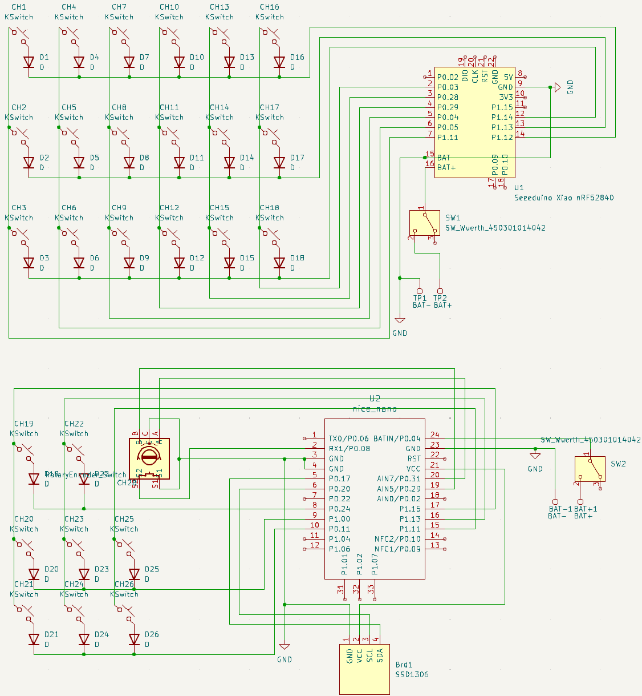
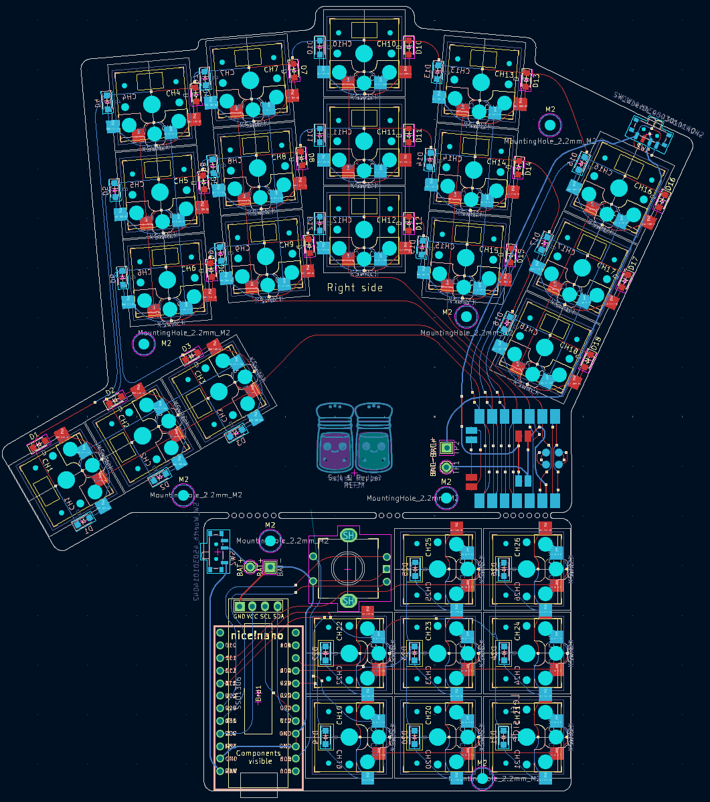

# Pipar PCBs

**Pipar** is a collection of different keyboards and keypads that I have designed. Each PCB in the series has unique features tailored to different needs and preferences.

## Designed PCBs

### Pipar

The **Pipar** is a 36-key split wireless keyboard with a 3x5+3 layout. It features:

- **Microcontrollers**: XIAO BLE for both halves and a dongle.
- **Switches**: Ambients Silent Kailh Low Profile Nocturnal Choc Switches.
- **Sockets**: Kaihl Hotswap sockets for easy switch replacement.

Pipar is a splayed split keyboard with a 3x5+3 layout. The thumb cluster has three keys on each half, and the outer columns are split to reduce the distance to the keys. The keyboard is wireless and uses the XIAO BLE microcontroller for both halves and a dongle. The design a features a larger area for the battery.

### Pipar Flake

The **Pipar Flake** is an 8+1 key wireless keypad with a rotary encoder and a screen. It includes:

- **Microcontroller**: SuperMini NRF52840.
- **Display**: Tiny OLED display.
- **Switches**: Ambients Silent Kailh Low Profile Nocturnal Choc Switches.
- **Sockets**: Kaihl Hotswap sockets for easy switch replacement.

Pipar Flake is meant to be used as a tiny keypad or a numpad. My current usecase is to use it with Kodi to control the media player. Design wise I wanted it to be as small as possible while still being usable. The rotary encoder can be used to control the volume and the push button can be used to change layers.

## Schematic

Here is the schematic for the Pipar PCBs:

## Layout

The layout of the Pipar PCBs is shown below:

## Render

A render of the Pipar PCB design:

