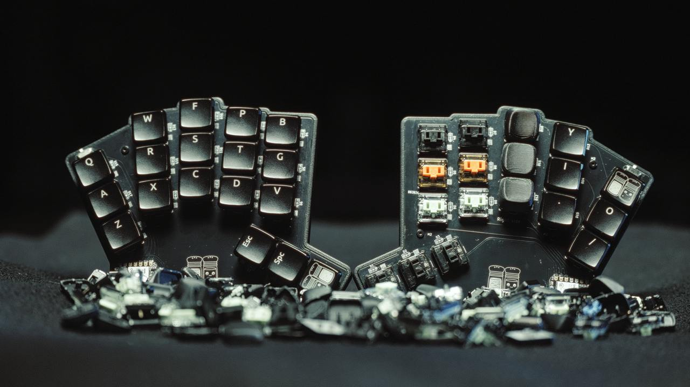

# Pipar & Sool Build Guide

You will be building your own Pipar & Sool keyboard. This guide will help you through the process of building the keyboard.

## Table of Contents

TODO

### What's in the Box

- 2x Pipar PCBs
- 3x XIAO BLE microcontrollers (2 for the halves, 1 for the dongle)
  - 2 of the microcontrollers are installed to the PCBs
- 36x Diodes
- 36x Kailh Hotswap sockets
- 2x On/Off Switches
- 2x cases (one for each half)
- 10x M2x3mm heat-set inserts (Installed in the case)
- 10x M2x4mm screws (hex 1.3 or philips)

### Tools Required

- Soldering Iron
- Solder
- Tweezers
- Screwdriver/Hex key
- Heat gun (optional)
- Multimeter (optional)

### Order of Assembly

1. Solder the diodes to the PCBs.
2. Solder the Kailh hotswap sockets to the PCBs.
3. Solder the power switch to the PCB.
4. Solder the battery to the PCB.
5. Verify the battery is connected correctly.
6. Install the switches and keycaps.

### How to assemble

> [!NOTE]
> If you are new to soldering, you can check out a quick video guide on how to solder [**here**](https://youtu.be/HycbZviKKUg)

1. Unscrew the 10 screws attaching the PCBs to the case.
2. Remove the PCBs from the case.
3. Solder the diodes to the bottom of the PCB on each half (diodes should be mounted inside the case).
    - The direction of the diodes is important, the line direction on the diode should match the line on the PCB.
4. Solder the Kailh hotswap sockets to the bottom of the PCB on each half.
    - The sockets should be mounted inside the case.
    - The sockets should be flush with the PCB.
    - The socket direction is important, make sure the socket is oriented correctly by checking the square and hexagon drawing on the PCB.
5. Verify the diodes and sockets are soldered correctly.
    - Use a multimeter to check the pads.
6. Solder the power switch to the top of the PCB.
7. Turn the power switch off (on both halves - left is off, right is on).
8. Clean the board of any flux residue.
9. Solder on the battery.
10. Verify the battery is soldered correctly by checking the voltage. The battery should be around 3.7V.
11. Turn the power switch on (on both halves - left is off, right is on).
12. Measure the 3.3V and GND pins on the microcontroller to verify the battery is connected correctly. The voltage should be 3.3V.
    - If the voltage is not correct (showing 0), check the battery connection and that the power switch is on.
    - If the voltage shows 3.7V on the battery when the switch is off and 0V when the switch is on then there is a short circuit.
13. Plug in the dongle to your computer and the halves should connect to the dongle.
14. Check the keys on each half to verify they are working correctly, use tweezers to short the pads.
15. Turn everything off
16. Carefully install the switches and keycaps. Support the hotswap sockets from the bottom when installing the switches.
17. Screw the PCB back into the case.
18. Enjoy your new keyboard!

### Tips for soldering

- Add flux when ever possible.
- When soldering the diodes, tin one pad, then heat the pad and slide the diode into place. Then solder the other side.
- When soldering the sockets, tin both pads with a small amount of solder, then place the socket in and while applying pressure with tweezers heat the pad and socket until the solder melts. Then repeat for the other side.
- When soldering the battery, tin the wires so they do not fray and then solder them to the pads. Make sure the positive battery wire is not shorting against the PCB.
- Clean the flux residue with isopropyl alcohol.
  - **Do this before installing the switches and keycaps.**
